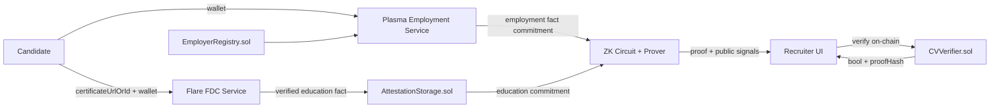

# SovereignCV Agent TODOs

## 1. Mission and Scope
SovereignCV is a privacy-preserving CV verification system for ETH Oxford 2026.

1. Main track: programmable cryptography with ZK privacy.
2. Side track: Flare FDC for Web2 education data attestation.
3. Side track: Plasma stablecoin payment verification for employment signals.

MVP objective:

1. Verify education and employment facts.
2. Generate a ZK proof that hides private wallet and salary details.
3. Let recruiters verify proof and view a highlighted CV with trust badges.

Locked MVP output shown to recruiter:

1. Pass/fail.
2. Proof hash.
3. Verified badges for education and employment lines.

The recruiter must not see:

1. Raw wallet address.
2. Raw stablecoin amounts.
3. Raw certificate identifier/witness payload.

## 2. Constraint Note
1. Original Flare Notion URL was inaccessible (`404`) in this environment.
2. This execution document is grounded on the user-provided Flare guide content plus official references:
   - https://dev.flare.network/
   - https://dev.flare.network/fdc/getting-started/
   - https://dev.flare.network/fdc/guides/hardhat/web-2-json/
   - https://docs.circom.io/
3. Verifier endpoints can require API key. Use the key path documented in Flare hardhat starter `.env.example`.

## 3. Architecture Overview


## 4. Public Interfaces (Frozen by Hour 8)

### 4.1 Smart Contracts
#### `EmployerRegistry.sol`
Functions:

1. `addEmployer(address employer)`
2. `removeEmployer(address employer)`
3. `isEmployer(address employer) external view returns (bool)`

Events:

1. `EmployerAdded(address employer)`
2. `EmployerRemoved(address employer)`

Rules:

1. `addEmployer` and `removeEmployer` are owner-only.
2. Zero address must be rejected.
3. No-op duplicates should revert with clear reason.

#### `AttestationStorage.sol`
Functions:

1. `recordEducationAttestation(bytes32 attestationId,address subject,bytes32 certHash,string provider,uint64 issuedAt)`
2. `getEducationAttestation(bytes32 attestationId) external view returns (address subject,bytes32 certHash,string memory provider,uint64 issuedAt,bool exists)`

Events:

1. `EducationAttested(bytes32 attestationId,address subject,bytes32 certHash,string provider,uint64 issuedAt)`

Rules:

1. Duplicate `attestationId` writes must revert.
2. `subject` must be non-zero address.
3. `provider` must be non-empty.

#### `CVVerifier.sol`
Functions:

1. `verifyCVProof(bytes calldata proof,uint256[] calldata publicSignals) external returns (bool)`

Events:

1. `CVProofVerified(address verifier,bytes32 proofHash,bool success)`

Rules:

1. Uses Groth16 verifier contract generated from Circom.
2. Computes `proofHash = keccak256(abi.encode(proof, publicSignals))`.
3. Emits event on every verification call.

### 4.2 Backend APIs
#### `POST /fdc/education/submit`
Request:

```json
{
  "wallet": "0x...",
  "provider": "udemy|coursera",
  "certificateUrlOrId": "string"
}
```

Response:

```json
{
  "requestId": "string",
  "status": "pending|accepted|rejected"
}
```

#### `GET /fdc/education/status/:requestId`
Response:

```json
{
  "status": "pending|verified|failed|timeout",
  "attestationId": "0x... or null",
  "txHash": "0x... or null",
  "reason": "string or null"
}
```

#### `GET /plasma/employment/:wallet`
Response:

```json
{
  "wallet": "0x...",
  "employer": "0x... or null",
  "monthsMatched": ["2025-11", "2025-12", "2026-01"],
  "paymentCount": 3,
  "qualifies": true,
  "factCommitment": "0x..."
}
```

#### `GET /facts/:wallet`
Response:

```json
{
  "educationQualified": true,
  "employmentQualified": true,
  "educationCommitment": "0x...",
  "employmentCommitment": "0x...",
  "combinedCommitment": "0x..."
}
```

### 4.3 Shared Types
`EducationFact`

1. `wallet: string`
2. `provider: "udemy" | "coursera"`
3. `certHash: string`
4. `fdcRequestId: string`
5. `attestationId: string`
6. `timestamp: number`

`EmploymentFact`

1. `wallet: string`
2. `employer: string`
3. `token: string`
4. `matchedMonths: [string, string, string]`
5. `transferCount: number`
6. `qualifies: boolean`

`CVPublicSignals`

1. `requiredSkillHash: string`
2. `minExperienceMonths: number`
3. `educationCommitment: string`
4. `employmentCommitment: string`
5. `result: 0 | 1`

## 5. Rules and Algorithms

### 5.1 Employment Qualification Rule (Plasma)
Strict rule for MVP:

1. Candidate must have at least one incoming stablecoin transfer in each of three consecutive calendar months.
2. All three qualifying transfers must originate from the same employer address.
3. Employer address must be in `EmployerRegistry`.
4. Token contract must be in stablecoin allowlist.

Deterministic month key:

1. Convert transfer timestamp to UTC.
2. Month key format: `YYYY-MM`.

If multiple employers qualify:

1. Select employer with highest total qualifying transfers over the consecutive window.
2. Tie-break by lexicographically smallest lowercase address.

### 5.2 Education Attestation Rule (Flare FDC)
MVP source strategy:

1. Backend normalizes Udemy/Coursera certificate source to canonical JSON.
2. FDC Web2Json verifies canonical response.
3. Backend calls `AttestationStorage.recordEducationAttestation(...)` after verification success.

Canonical certificate hash:

1. Serialize canonical JSON keys in fixed order.
2. Hash with `keccak256`.
3. Store as `certHash`.

### 5.3 Commitment Construction
Employment commitment:

1. Canonical payload: `wallet|employer|token|month1|month2|month3|paymentCount|qualifies`.
2. Hash: `keccak256(utf8(payload))`.

Education commitment:

1. Canonical payload: `wallet|provider|certHash|attestationId|timestamp`.
2. Hash: `keccak256(utf8(payload))`.

Combined commitment:

1. `keccak256(abi.encode(educationCommitment, employmentCommitment))`.

## 6. Agent Split and Deliverables

### Agent A: Flare FDC
Ownership:

1. `services/fdc/*`
2. FDC submission and polling logic.
3. Education source normalization.

Deliverables:

1. `POST /fdc/education/submit`
2. `GET /fdc/education/status/:requestId`
3. Chain write integration to `AttestationStorage`.
4. One successful testnet attestation transaction hash.
5. `services/fdc/README.md` with env variables and retry strategy.

Done when:

1. Pending, success, timeout, and failure paths are all executable.
2. At least one verified attestation recorded on testnet.

### Agent B: Plasma Employment
Ownership:

1. `services/plasma/*`
2. Plasma transfer indexing via RPC logs.
3. Qualification and commitment logic.

Deliverables:

1. `GET /plasma/employment/:wallet`
2. Stablecoin allowlist config.
3. Wallet pass/fail fixtures.
4. Fallback adapter for explorer/indexer when RPC fails.

Done when:

1. Rule passes known positive fixtures and fails known negatives.
2. Output is deterministic across re-runs.

### Agent C: Contracts
Ownership:

1. `contracts/*.sol`
2. `scripts/deploy.ts`
3. `deployments/testnet/*.json`

Deliverables:

1. `EmployerRegistry.sol`
2. `AttestationStorage.sol`
3. `CVVerifier.sol` wrapper with event.
4. Deploy scripts with chain-specific config.
5. ABI and deployed address artifacts for consumers.

Done when:

1. Unit tests pass for access control and core behavior.
2. Deployed addresses artifact is generated for testnet.

### Agent D: ZK
Ownership:

1. `circuits/verifySovereignCV.circom`
2. proving and verification scripts.
3. verifier artifact handoff.

Deliverables:

1. Circuit for employment and education assertions.
2. Groth16 artifacts: `.wasm`, `.zkey`, keys, verifier contract.
3. Witness/proof generation script.
4. Constraint summary document.

Done when:

1. Valid witness verifies.
2. Tampered public signal fails.
3. Missing-month or invalid-cert witness fails.

### Agent E: Frontend
Ownership:

1. `apps/recruiter-ui/*`
2. on-chain verification UX.
3. CV highlighting and badge rendering.

Deliverables:

1. Wallet connect via wagmi/rainbowkit or wagmi native connectors.
2. `Verify CV` action calling `CVVerifier`.
3. Proof status cards and line-level green highlights.
4. Error states for chain mismatch and verification failure.

Done when:

1. Recruiter can verify proof end-to-end.
2. No private fields are shown in UI.

### Agent F: Integration and Submission
Ownership:

1. Interface freeze coordination.
2. End-to-end runbook validation.
3. Demo and submission package assembly.

Deliverables:

1. Integration checklist.
2. Final demo script.
3. README bounty sections and pitch framing.
4. Collected artifacts: tx hashes, proof hash, screenshots.

Done when:

1. Full flow runs from certificate submit to recruiter verify.
2. Submission text is ready for all tracks.

## 7. Branching and PR Merge Order
Branch naming:

1. `feat/agent-a-flare-fdc`
2. `feat/agent-b-plasma`
3. `feat/agent-c-contracts`
4. `feat/agent-d-zk`
5. `feat/agent-e-frontend`
6. `feat/agent-f-integration`

PR title format:

1. `[SovereignCV][Agent-X] <short summary>`

Merge order:

1. Agent C (contracts)
2. Agent A (Flare)
3. Agent B (Plasma)
4. Agent D (ZK)
5. Agent E (Frontend)
6. Agent F (Integration/docs)

Conflict policy:

1. `interfaces/` and `types/` changes require Agent F review.
2. No force-push to shared integration branches.
3. Rebase on `main` before requesting review.

## 8. Environment Matrix
| Component | Network | Required ENV | Notes |
|---|---|---|---|
| Contracts | Flare Coston2 | `FLARE_RPC_URL`, `DEPLOYER_PRIVATE_KEY` | Use Flare hardhat starter defaults where possible. |
| FDC Service | Flare verifier APIs | `FLARE_FDC_API_KEY`, `FDC_BASE_URL` | API key needed for non-rate-limited verifier access. |
| Plasma Indexer | Plasma testnet | `PLASMA_RPC_URL`, `PLASMA_CHAIN_ID` | RPC logs are primary data source. |
| Frontend | Testnet wallet | `NEXT_PUBLIC_CHAIN_ID`, `NEXT_PUBLIC_CV_VERIFIER_ADDRESS` | Enforce chain check in UI. |
| Shared | n/a | `STABLECOIN_ALLOWLIST`, `EMPLOYER_REGISTRY_ADDRESS` | Keep synced with deployed artifacts. |

Required secrets handling:

1. Do not commit private keys or API keys.
2. Use `.env.example` with placeholders.
3. Rotate booth-provided keys after hackathon if necessary.

## 9. Canonical End-to-End Runbook
1. Deploy contracts and publish artifacts.
2. Add at least one employer to registry.
3. Submit candidate certificate via `/fdc/education/submit`.
4. Poll `/fdc/education/status/:requestId` until `verified`.
5. Query `/plasma/employment/:wallet` and confirm `qualifies=true`.
6. Query `/facts/:wallet` and capture commitments.
7. Generate proof with ZK scripts using commitments.
8. Open recruiter UI and submit proof for on-chain verification.
9. Confirm `CVProofVerified` event and UI highlights.

## 10. Edge Cases and Failure Handling
1. FDC unavailable:
   - Queue request.
   - Retry with exponential backoff.
   - Expose `pending` status and retry metadata.
2. Certificate source unreachable:
   - Mark as `failed`.
   - Include machine-readable reason.
3. Plasma RPC limits:
   - Use fallback indexer.
   - Include `dataSource` in logs for provenance.
4. Stale commitments:
   - Reject at verification.
   - UI prompts refresh and proof regeneration.
5. Wrong chain:
   - UI blocks verify action and asks switch network.

## 11. Test Matrix

### Contract Tests
1. Only owner can mutate employer registry.
2. Duplicate employer add/remove behavior is correct.
3. Education attestation write emits correct event.
4. Duplicate attestation ID reverts.
5. `CVVerifier` emits proof hash and result.

### Backend Tests
1. FDC submit/status: pending, success, timeout, invalid source.
2. Plasma month-boundary checks with UTC date transitions.
3. Deterministic commitment generation across repeated runs.
4. Fallback source path when RPC is unavailable.

### ZK Tests
1. Valid education + employment witness yields `result=1`.
2. Missing one month yields failure.
3. Invalid certificate witness yields failure.
4. Public signal tampering invalidates verification.

### Frontend Tests
1. Verify flow sends proof and receives on-chain result.
2. Success state highlights lines and shows badges.
3. Failure state does not reveal sensitive details.
4. Chain mismatch warning blocks verification.

## 12. 48-Hour Timeline
1. Hour 0-4:
   - Repo bootstrap.
   - Interface freeze.
   - Placeholder deployments.
2. Hour 4-20:
   - Parallel build by Agents A-E.
3. Hour 20-30:
   - First end-to-end integration.
4. Hour 30-40:
   - Bug fixes and reliability hardening.
5. Hour 40-48:
   - Demo capture and submission packaging.

## 13. Bounty Submission Checklist Text

### Main Track (Programmable Cryptography)
1. Explain circuit inputs and outputs.
2. Explain privacy guarantees: wallet and salary are private witness values.
3. Provide proof verification transaction and proof hash in demo.

### Flare Bounty
1. Explicitly state use of Flare Data Connector (Web2Json).
2. Explain how Web2 certificate data becomes on-chain attestation.
3. Include verifier flow description and testnet tx hash.

### Plasma Bounty
1. Show interaction with Plasma testnet for stablecoin payment history.
2. Explain strict consecutive calendar-month employment rule.
3. Include qualifying wallet example and resulting commitment/proof flow.

### Pitch Points
1. Privacy-first verification replaces manual background checks.
2. Automated trust checks reduce cost and latency.
3. Candidate controls disclosure while recruiter gets cryptographic assurance.

## 14. Final Acceptance Criteria
1. Contracts deployed to testnet with published addresses.
2. One verified education attestation recorded on-chain.
3. One wallet classified as employed by strict 3-month rule.
4. One valid ZK proof verifies on-chain.
5. Recruiter UI displays verified badges after proof verification.
6. README includes all bounty-specific explanation and artifacts.

